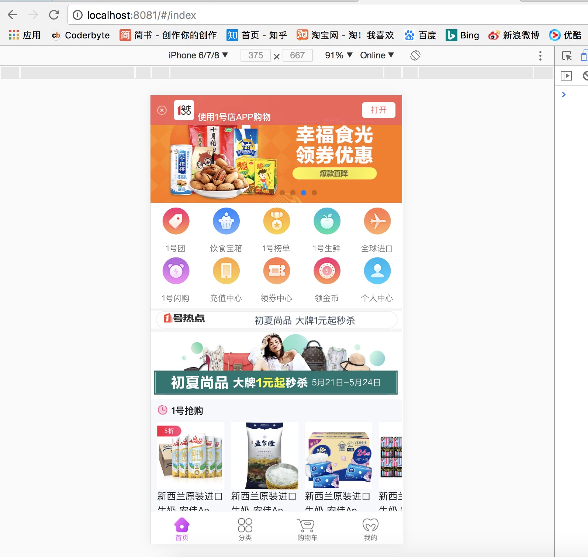

# vue-yhd-shop
    vue开发购物商城，模仿一号店

# 使用说明
    #克隆项目
    git clone https://github.com/pugbabu/vue-yhd-shop.git

    # 安装依赖
    npm install

    # 本地开发环境 访问http://localhost:8080
    npm run dev

    # 构建生产
    npm run build

### 使用的库

* vue-cli (vue+webpack脚手架)
* vue-router(路由跳转)
* vuex(状态管理)
* axios(数据请求)
* mock.js(模拟后台数据)
* vue-touch(手势判断)
* fastclick(解决移动端浏览器 300 毫秒点击延迟问题)
* vue-lazyload(图片懒加载)
* vue-awesome-swiper(轮播)

## 优化方案: 
* vue-lazyload(图片懒加载，缓解加载数据,提高网页性能)
* fastclick(解决移动端300ms延迟，提高页面交互流畅度)
* vue-rouer(路由懒加载,分离app的js为多个js文件，到对应的页面再执行对应的js)
* webpack(config/index.js文件内的productionSourceMap改为false,这样打包出来的文件可以没有.map结尾的js文件，且文件体积减少至少一半)

## 页面截图
